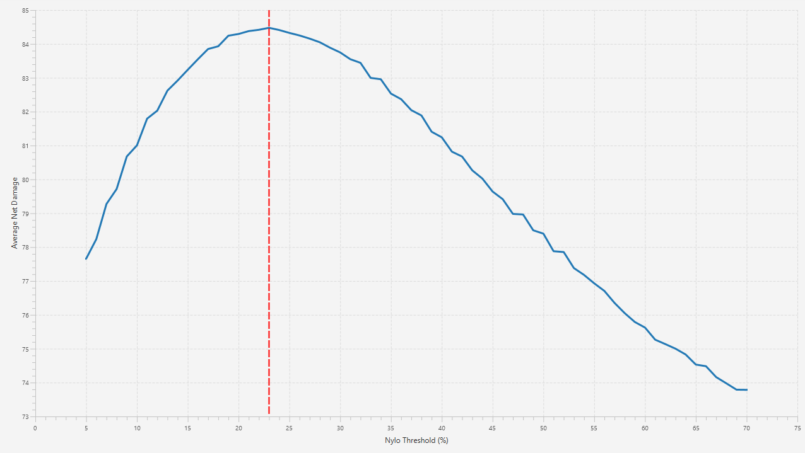

# OSRS Boss Simulator

## Overview

A Monte Carlo based simulation tool built with **Java (Maven, JavaFX)** to analyze strategies for Old School RuneScape (OSRS) combat encounters. The goal is to test different strategies and determine both their effectiveness and chances of success over a large number of simulations. Each simulation models accurate combat interactions with various bosses.

## Example: Verzik P2 Simulation

This chart shows the results of the Verzik Phase 2 simulation for the final 35% of her HP. The blue line represents the average net damage dealt to Verzik during this part of P2. The amount of net damage dealt changes depending on the percentage of Nylo HP at which you switch to damaging Verzik. The red dashed line shows the optimal threshold point, which is where the average net damage is maximized based on the accuracy roll and max hit of a given gear setup.